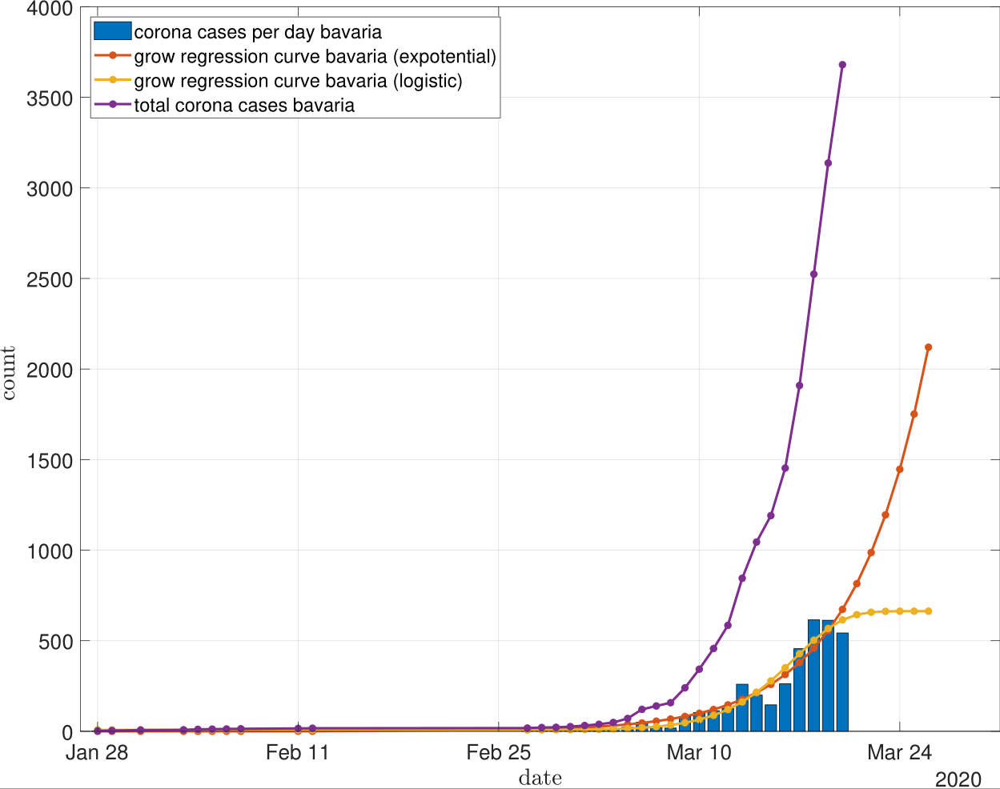

# Corona Statistic Fitter Bavaria
 Just small matlab program which reads data from www.lgl.bayern.de and displays fitting curves.
 
Just download the installer [CoronaStatisticBavaria_Installer.exe](https://github.com/net-attack/Corona-Statistic-Fitter-Bavaria/releases/tag/0.1)

